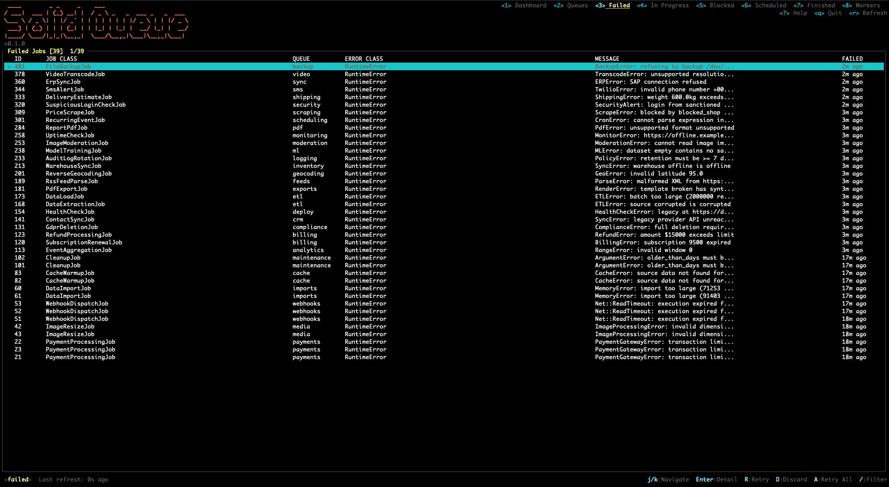
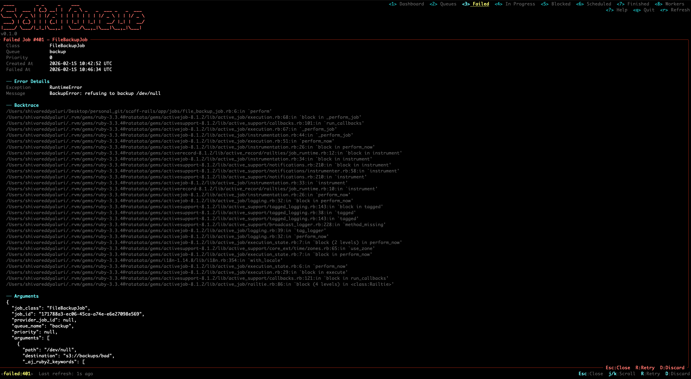
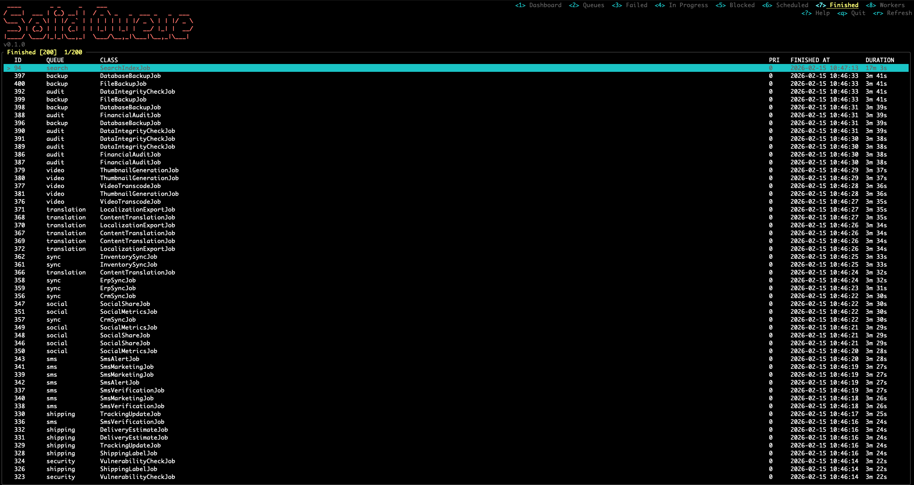

# Solid Queue TUI

> **Beta** — This project is under active development.

A terminal UI dashboard for [Solid Queue](https://github.com/rails/solid_queue), built with [ratatui_ruby](https://github.com/nicholasgasior/ratatui-ruby). Monitor and manage your Solid Queue jobs without leaving the terminal.






## Installation

Add to your Gemfile:

```ruby
gem "solid_queue_tui"
```

Then:

```bash
bundle install
```

## Usage

```bash
# Inside your Rails app directory
bundle exec sqtui

# Or with a database URL
sqtui --database-url postgres://localhost/myapp_queue

# SQLite
sqtui --database-url sqlite3:db/queue.sqlite3
```

## Views

Press `1`-`8` to switch between views:

| Key | View | Description |
|-----|------|-------------|
| `1` | Dashboard | Overview with job counts and process info |
| `2` | Queues | Per-queue breakdown with sizes |
| `3` | Failed | Failed jobs — retry or discard |
| `4` | In Progress | Jobs currently being processed |
| `5` | Blocked | Jobs blocked by concurrency limits |
| `6` | Scheduled | Jobs scheduled for future execution |
| `7` | Finished | Completed jobs |
| `8` | Workers | Active worker processes |

## Key Bindings

| Key | Action |
|-----|--------|
| `j` / `k` | Navigate up / down |
| `Enter` | View job details |
| `/` | Filter by class name |
| `R` | Retry failed job |
| `D` | Discard failed job |
| `Esc` | Back to Dashboard |
| `r` | Refresh |
| `q` | Quit |

## Requirements

- Ruby 3.2+
- Solid Queue
- One of: `sqlite3`, `pg`, `mysql2`

## License

MIT
