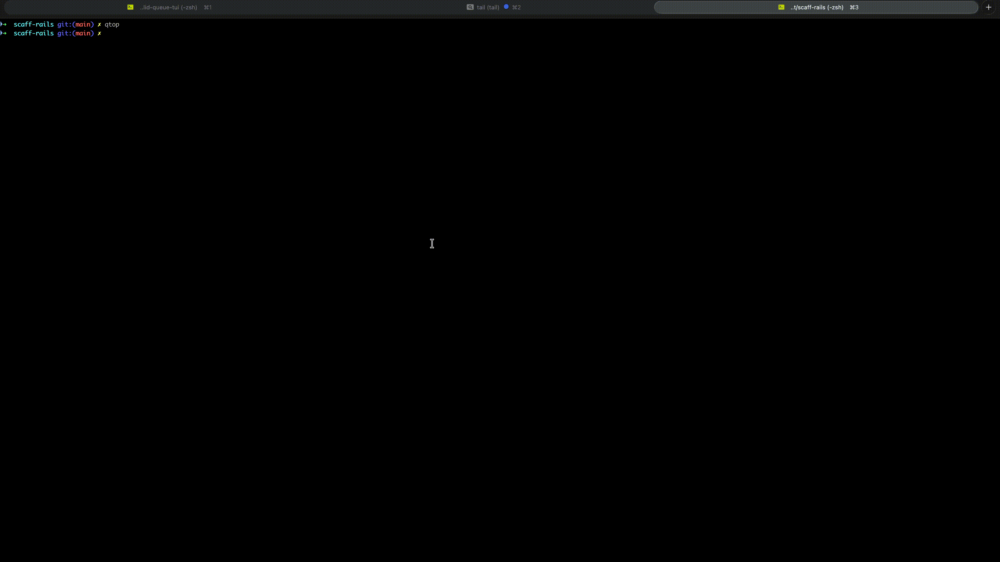

# Solid Queue TUI

A terminal UI dashboard for [Solid Queue](https://github.com/rails/solid_queue), built with [ratatui_ruby](https://www.ratatui-ruby.dev/). Monitor and manage your Solid Queue jobs without leaving the terminal.

[View all screenshots](screenshots/SCREENSHOTS.md)



## Requirements

- A **Rails application** (7.1+) with [Solid Queue](https://github.com/rails/solid_queue) configured as the Active Job backend
- Ruby 3.2.9+

This gem is a Rails Railtie. It uses the host app's existing database connection and Solid Queue's ActiveRecord models directly — no separate database configuration is needed.

## Installation

Add to your Rails app's Gemfile:

```ruby
gem "solid_queue_tui"
```

Then:

```bash
bundle install
```

## Usage

Run from your **Rails application's root directory**:

```bash
bundle exec qtop
```

The TUI boots your Rails environment (via `config/environment.rb`), connects to the same database your app uses, and queries Solid Queue tables through its ActiveRecord models.

You can also launch via a rake task:

```bash
bundle exec rake solid_queue_tui:start
```

> **Note:** The legacy `sqtui` command still works for backwards compatibility.

### Configuration

Configure via CLI flags:

```bash
bundle exec qtop --page-size 50 --refresh-interval 5
```

| Flag | Default | Description |
|------|---------|-------------|
| `--page-size N` | `100` | Number of rows loaded per page |
| `--refresh-interval N` | `2` | Auto-refresh interval in seconds |

Or via a Rails initializer:

```ruby
# config/initializers/solid_queue_tui.rb
SolidQueueTui.page_size = 50
SolidQueueTui.refresh_interval = 5
```

CLI flags take precedence over initializer values.


## Platform notes

`ratatui_ruby` ships precompiled binaries for **macOS (ARM)**, **Linux (x86_64)**, and **Windows**. On these platforms, `bundle install` works out of the box.

On **ARM Linux** (e.g., Docker on Apple Silicon, AWS Graviton), there is no precompiled binary yet — Bundler will compile from source, which requires the **Rust toolchain** in your build environment:

```dockerfile
# Example: adding Rust to a Dockerfile for ARM Linux builds
# Install packages needed to build gems and Rust/clang toolchain for native extensions (ratatui_ruby)
RUN apt-get update -qq && \
    apt-get install --no-install-recommends -y build-essential git libpq-dev libyaml-dev pkg-config curl libclang-dev && \
    curl --proto '=https' --tlsv1.2 -sSf https://sh.rustup.rs | sh -s -- -y && \
    rm -rf /var/lib/apt/lists /var/cache/apt/archives

ENV PATH="/root/.cargo/bin:${PATH}"
```

## Contributing

See [CONTRIBUTING.md](CONTRIBUTING.md) for development setup, debugging tips, and architecture overview.

## License

MIT
