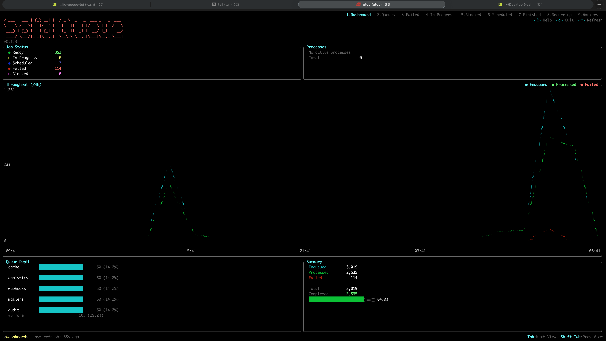
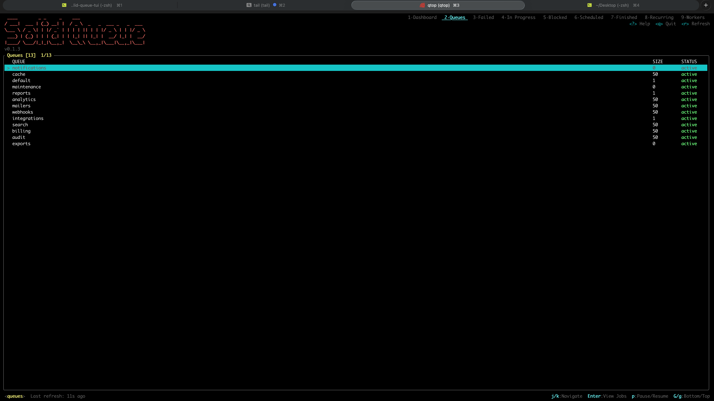
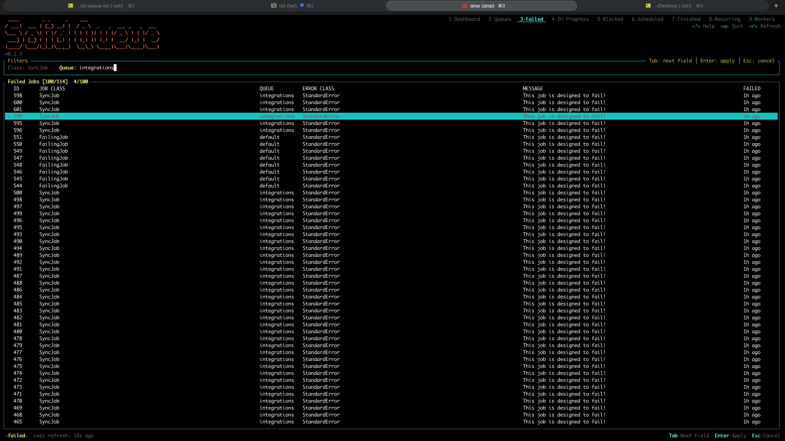
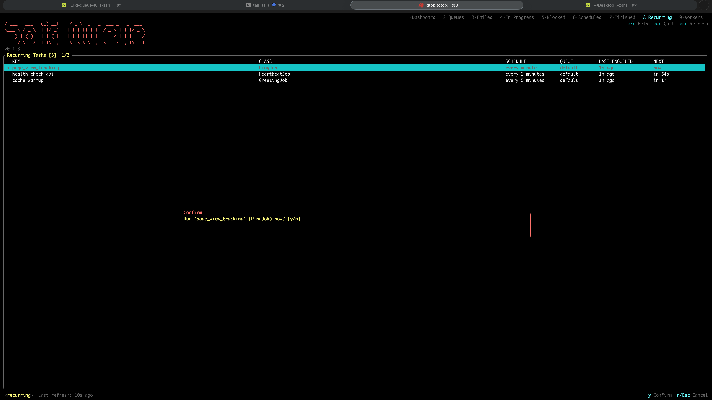
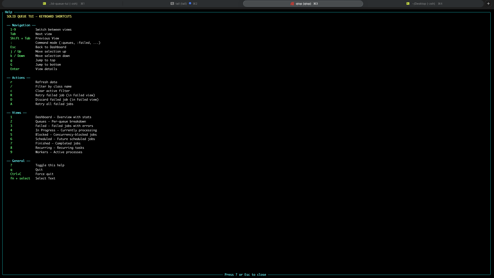

# Screenshots

## Dashboard

The main dashboard with real-time metrics: job status, active processes, 24h throughput chart, queue depth breakdown, and completion summary.

## Queues

Browse all queues with their size and status. Press `Enter` to drill down into a queue's jobs, `p` to pause/resume.

## Filters

Filter any view by queue, class name, or other fields. Type `/` to open the filter prompt, `c` to clear.

## Error Detail View

Inspect failed jobs with full error details: exception class, message, backtrace, and raw metadata.

## Confirmation Dialog

Destructive actions (retry, discard, enqueue) require confirmation before executing.

## Help

Press `?` to view all keyboard shortcuts organized by category: navigation, actions, views, and general.

